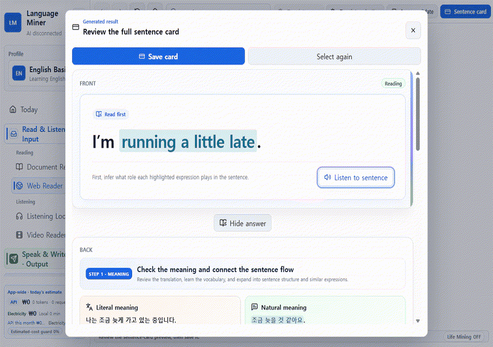

# Language Miner

Language Miner is a local-first Windows app for turning useful English sentences into cards and carrying expressions from reading and listening into speaking and writing.

[Official download site](https://language-miner-guide.bunnywater1227.chatgpt.site/en) · [한국어](README.md) · [Visual walkthrough](https://meowthologysaga.github.io/Language_Miner/en/tutorial.html) · [Complete user manual](docs/complete-user-manual.en.md) · [Feature reference](docs/user-guide.en.md) · [Privacy notice](docs/privacy.en.md) · [UGC policy](docs/ugc-policy.en.md)

> **Release status:** The first public beta, [`v0.1.0-beta.1`](https://github.com/MeowthologySaga/Language_Miner/releases/tag/v0.1.0-beta.1), is available. Its official Release contains Windows 10/11 x64 installer and portable builds, SHA-256 checksums, an SBOM, and the complete source.



*Find one sentence, turn it into a card, review it, and use it*

## Why memorized English can still be hard to use

Recognizing a word and retrieving a sentence when you need it are different skills. Language Miner keeps study from ending in one direction.

1. Find an expression in a book, website, video, or conversation.
2. Save a sentence with context instead of an isolated word.
3. Recognize it again through reading and listening cards.
4. Retrieve the same meaning through speaking and writing cards.
5. Reuse it in writing practice and character conversations.

For example, after finding `I’m running a little late.`, you can save it as a card, hear it, produce it from the meaning “I’m going to be a little late,” and then use it in a character chat about meeting someone.

## The learning loop

| Stage | What you do | What it builds |
| --- | --- | --- |
| Discover | Select an expression from a document, the web, a video, or Life Mining | Material connected to your life and interests |
| Make cards | Save reading, listening, and speaking cards | Memory tied to sentences and context |
| Review | Review due cards with spaced repetition | Durable recall practice |
| Use | Reuse expressions in writing, Character Chat, and PlayZone | A bridge from recognition to production |

### PlayZone and Character Chat

- **PlayZone** is a UGC space where game packs can use local study rewards and expressions. Only packs marked `ready` or `trusted_official` can run.
- **Character Chat** lets you test expressions in situations shaped by a character and scenario. When a cloud AI is connected, the app shows what conversation context will be sent before the session starts.

Character cards and game packs are licensed separately by their creators; the app’s GPL license does not automatically apply to them. If an official community opens, it will accept general-audience content only.

## A practical first-start sequence

1. In **Manage → Tutorial**, use the Reading Card exercise to practice selecting `I’m running a little late.` The sandbox teaches the controls but does not change your real card library.
2. To save a real card, open **Read & Listen · Input → Web Reader** and select a sentence from your own material or a public webpage.
3. Start with one reading card. Listening and speaking cards are created separately from their listening and Life Mining screens.
4. Recall before revealing the answer in Review, then retrieve the expression again in a short writing exercise.
5. Connect AI only if you need it. AI starts disconnected on a new installation.

Follow the [visual walkthrough](https://meowthologysaga.github.io/Language_Miner/en/tutorial.html), or learn every workflow from the beginning in the [complete user manual](docs/complete-user-manual.en.md). Use the shorter [feature reference](docs/user-guide.en.md) when you need one specific setting or action.

## Local-first, with optional AI

- Cards, review history, conversations, and settings are stored on this PC by default. Learning data other than API keys may be stored locally in plaintext, so take care on a shared Windows account.
- AI is **disconnected by default** on a new installation.
- A loopback Ollama connection is presented as the local-first option. A remote Ollama URL is not labeled local.
- Gemini and Google features require your own key and an explicit review of what will be sent externally.
- ChatGPT subscribers can choose a manual `copy prompt → generate on the web → paste JSON` bridge without an API key. The app never collects ChatGPT login cookies or web responses automatically.
- The in-app cost guard is an **on-device usage estimate and stop signal**. It cannot block charges on your Google billing account.
- The project does not operate advertising, analytics, or developer telemetry servers.

See the [privacy notice](docs/privacy.en.md) for the storage and external-transfer table.

## Download

The [`v0.1.0-beta.1` official download page](https://github.com/MeowthologySaga/Language_Miner/releases/tag/v0.1.0-beta.1) provides:

- Windows 10/11 x64 NSIS installer
- Windows 10/11 x64 portable executable
- SHA-256 checksums
- SBOM
- Complete source for that version

The first beta is unsigned. This Release uses GitHub immutable releases, so its published tag and assets cannot be edited in place. Even so, compare your file's SHA-256 with `SHA256SUMS.txt` from the official tag page before running it. See [Windows installation and SmartScreen](docs/install-windows.en.md).

The official Discord is not open yet. Until its address is announced in this repository, do not trust communities or binaries claiming to represent Language Miner.

## Run from source

Requirements: Windows 10/11 x64, Node.js, and npm.

```powershell
npm ci
npm run dev
```

Checks and builds:

```powershell
npm run typecheck
npm test
npm run build
npm run dist:installer
npm run dist:portable
```

Read [CONTRIBUTING.md](CONTRIBUTING.md) and [SECURITY.md](SECURITY.md) before contributing. Do not report vulnerabilities in a public issue.

## Documentation

- [Visual walkthrough](https://meowthologysaga.github.io/Language_Miner/en/tutorial.html) / [화면 따라 하기](https://meowthologysaga.github.io/Language_Miner/tutorial.html)
- [Complete user manual](docs/complete-user-manual.en.md) / [완전 사용 설명서](docs/complete-user-manual.ko.md)
- [Feature reference](docs/user-guide.en.md) / [기능 참조](docs/user-guide.ko.md)
- [YouTube tutorial series script (Korean)](docs/youtube-series-script.ko.md)
- [Privacy notice](docs/privacy.en.md) / [개인정보 안내](docs/privacy.ko.md)
- [UGC policy](docs/ugc-policy.en.md) / [UGC 정책](docs/ugc-policy.ko.md)
- [Creator guide](docs/creator-guide.en.md) / [제작자 가이드](docs/creator-guide.ko.md)
- [Project background](docs/project-background.en.md) / [프로젝트 배경](docs/project-background.ko.md)
- [Asset provenance and rights inventory](docs/asset-inventory.md)

## License

The Language Miner application code is licensed under [GNU GPL-3.0-only](LICENSE). UGC, sample content, images, audio, video, and third-party components remain under their separately stated licenses. See [THIRD_PARTY_NOTICES.md](THIRD_PARTY_NOTICES.md) and the [asset inventory](docs/asset-inventory.md).
