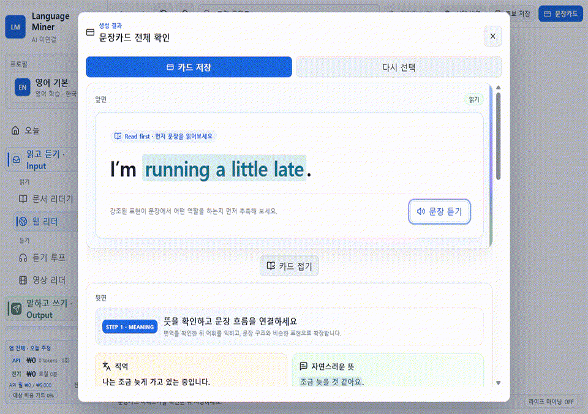

# Language Miner

발견한 영어 문장을 카드로 만들고, 읽기·듣기에서 얻은 표현을 말하기·영작으로 다시 꺼내 쓰는 로컬 우선 Windows 학습 앱입니다.

[공식 다운로드 사이트](https://language-miner-guide.bunnywater1227.chatgpt.site/) · [English](README.en.md) · [화면 따라 하기](https://meowthologysaga.github.io/Language_Miner/tutorial.html) · [완전 사용 설명서](docs/complete-user-manual.ko.md) · [기능 참조](docs/user-guide.ko.md) · [개인정보 안내](docs/privacy.ko.md) · [UGC 정책](docs/ugc-policy.ko.md)

> **배포 상태:** 첫 공개 베타 [`v0.1.0-beta.1`](https://github.com/MeowthologySaga/Language_Miner/releases/tag/v0.1.0-beta.1)을 배포했습니다. Windows 10/11 x64용 설치판, 포터블판, SHA-256 체크섬, SBOM과 전체 소스를 같은 공식 Release에서 받을 수 있습니다.



*한 문장을 발견해서 카드로 만들고, 복습하고, 직접 쓰는 학습 루프*

## 외웠는데도 말이 나오지 않는 이유

단어 뜻을 알아보는 것과, 필요한 순간에 문장을 직접 꺼내는 것은 다른 기술입니다. Language Miner는 학습을 한 방향으로 끝내지 않습니다.

1. 책·웹·영상·대화에서 실제로 쓰고 싶은 표현을 발견합니다.
2. 단어 하나가 아니라 맥락이 있는 문장 카드로 저장합니다.
3. 읽기·듣기 카드로 표현을 다시 알아봅니다.
4. 말하기·영작 카드로 같은 뜻을 영어로 꺼내 봅니다.
5. 복습한 표현을 글쓰기와 캐릭터 대화에서 다시 사용합니다.

예를 들어 `I’m running a little late.`를 발견했다면 뜻만 외우지 않습니다. 문장을 카드로 만들고, 소리를 듣고, “조금 늦을 것 같아요”를 보고 영어로 말한 뒤, 캐릭터챗에서 약속 시간에 늦는 상황에 직접 써 봅니다.

## 핵심 학습 루프

| 단계 | 하는 일 | 얻는 것 |
| --- | --- | --- |
| 발견 | 문서, 웹, 영상, Life Mining에서 표현 선택 | 내 생활과 관심사에 맞는 재료 |
| 카드 | 읽기·듣기·말하기 카드로 저장 | 문장과 맥락이 연결된 기억 |
| 복습 | 간격 반복으로 필요한 카드 복습 | 오래 남는 회상 연습 |
| 사용 | 영작과 캐릭터챗에서 표현 사용 | 알아보는 영어를 꺼내 쓰는 영어로 전환 |

### PlayZone과 캐릭터챗

- **PlayZone**은 학습으로 얻은 로컬 다이아를 검증된 게임팩의 선택형 기능에 사용해 학습 동기를 강화하는 UGC 공간입니다. 게임 안에서 영어 표현을 학습하는 기능은 아닙니다. 검증 상태가 `ready` 또는 `trusted_official`인 팩만 실행합니다.
- **캐릭터챗**은 캐릭터 설정과 상황을 이용해 실제 대화처럼 표현을 시험하는 공간입니다. 클라우드 AI를 연결하면 전송되는 대화 범위를 실행 전에 확인합니다.

앱 코드와 별개로 캐릭터 카드와 게임팩은 제작자가 각자의 라이선스를 표시합니다. 공식 커뮤니티를 열게 되면 일반 이용가 콘텐츠만 받습니다.

## 처음 시작하는 순서

1. **관리 → 튜토리얼**의 읽기 카드 연습에서 `I’m running a little late.`를 선택하는 조작을 먼저 익힙니다. 이 샌드박스 연습은 실제 카드 목록을 바꾸지 않습니다.
2. 실제로 저장할 때는 **읽고 듣기 · Input → 웹 리더**에서 내가 읽던 자료나 공개 웹페이지의 문장을 선택합니다.
3. 먼저 읽기 카드의 원문·뜻·문맥을 확인해 저장합니다. 듣기 카드와 말하기 카드는 각각 듣기·Life Mining 화면에서 만듭니다.
4. 답을 보기 전에 떠올려 보며 첫 복습을 하고, 같은 표현을 짧은 영작에서 다시 꺼냅니다.
5. AI가 필요할 때만 연결합니다. 새 설치에서는 AI가 꺼져 있습니다.

스크린샷과 함께 따라 하려면 [화면 튜토리얼](https://meowthologysaga.github.io/Language_Miner/tutorial.html), 처음부터 모든 기능을 익히려면 [완전 사용 설명서](docs/complete-user-manual.ko.md)를 참고하세요. 빠르게 특정 기능만 찾을 때는 [기능 참조](docs/user-guide.ko.md)를 이용할 수 있습니다.

## 로컬 우선과 AI 선택권

- 학습 카드, 복습 기록, 대화와 설정은 기본적으로 이 PC에 저장됩니다. API 키를 제외한 학습 데이터는 로컬에서 평문으로 저장될 수 있으므로 공용 Windows 계정에서는 사용에 주의하세요.
- 새 설치의 기본값은 **AI 미연결**입니다.
- 먼저 loopback 주소의 Ollama 같은 로컬 연결을 안내합니다. 원격 Ollama 주소는 로컬로 표시하지 않습니다.
- Gemini와 Google 기능은 사용자가 자신의 키를 넣고, 외부 전송 내용을 확인해 동의한 뒤에만 사용합니다.
- ChatGPT 구독자는 API 키 없이 `프롬프트 복사 → 웹에서 생성 → JSON 붙여넣기` 수동 브리지를 선택할 수 있습니다. 앱은 ChatGPT 로그인 쿠키나 웹 응답을 자동 수집하지 않습니다.
- 앱의 비용 가드는 이 기기에서 계산한 **예상 사용량 알림·중지 장치**입니다. Google의 실제 청구를 막는 결제 한도가 아닙니다.
- 개발자 소유 광고, 분석, 텔레메트리 서버를 사용하지 않습니다.

기능별 저장 위치와 외부 전송 항목은 [개인정보 안내](docs/privacy.ko.md)에 정리되어 있습니다.

## 다운로드

[`v0.1.0-beta.1` 공식 다운로드](https://github.com/MeowthologySaga/Language_Miner/releases/tag/v0.1.0-beta.1)에서 다음 파일을 받을 수 있습니다.

- Windows 10/11 x64 NSIS 설치판
- Windows 10/11 x64 포터블 실행 파일
- SHA-256 체크섬
- SBOM
- 해당 버전 전체 소스

첫 베타는 코드 서명이 없는 빌드입니다. 이 Release에는 GitHub의 변경 불가(immutable) 설정이 적용되어 게시된 태그와 파일을 나중에 같은 Release 안에서 바꿀 수 없습니다. 그래도 실행 전에는 공식 태그 페이지에서 받은 `SHA256SUMS.txt`와 파일의 SHA-256을 비교하세요. [Windows 설치 및 SmartScreen 안내](docs/install-windows.ko.md)

공식 Discord는 아직 열지 않았습니다. 이 저장소에 주소가 공지되기 전에는 Language Miner를 사칭하는 커뮤니티나 배포 파일을 신뢰하지 마세요.

## 소스에서 실행

필요 조건: Windows 10/11 x64, Node.js와 npm.

```powershell
npm ci
npm run dev
```

검사와 빌드:

```powershell
npm run typecheck
npm test
npm run build
npm run dist:installer
npm run dist:portable
```

기여 전에 [CONTRIBUTING.md](CONTRIBUTING.md)와 [SECURITY.md](SECURITY.md)를 읽어 주세요. 보안 취약점은 공개 이슈로 제보하지 않습니다.

## 문서

- [화면 따라 하기](https://meowthologysaga.github.io/Language_Miner/tutorial.html) / [Visual walkthrough](https://meowthologysaga.github.io/Language_Miner/en/tutorial.html)
- [완전 사용 설명서](docs/complete-user-manual.ko.md) / [Complete user manual](docs/complete-user-manual.en.md)
- [기능 참조](docs/user-guide.ko.md) / [Feature reference](docs/user-guide.en.md)
- [유튜브 사용법 영상 대본](docs/youtube-series-script.ko.md)
- [개인정보 안내](docs/privacy.ko.md) / [Privacy notice](docs/privacy.en.md)
- [UGC 정책](docs/ugc-policy.ko.md) / [UGC policy](docs/ugc-policy.en.md)
- [제작자 가이드](docs/creator-guide.ko.md) / [Creator guide](docs/creator-guide.en.md)
- [프로젝트 배경](docs/project-background.ko.md) / [Project background](docs/project-background.en.md)
- [자산 출처·권리 인벤토리](docs/asset-inventory.md)

## 라이선스

Language Miner 앱 코드는 [GNU GPL-3.0-only](LICENSE)로 배포합니다. UGC, 샘플 콘텐츠, 이미지, 음성, 영상과 제3자 구성요소에는 각 항목에 표시된 별도 라이선스가 적용됩니다. 자세한 내용은 [THIRD_PARTY_NOTICES.md](THIRD_PARTY_NOTICES.md)와 [자산 인벤토리](docs/asset-inventory.md)를 확인하세요.
