# Language Miner 사용자 가이드

[English](user-guide.en.md) · [화면 따라 하기](https://meowthologysaga.github.io/Language_Miner/tutorial.html) · [README](../README.md) · [개인정보 안내](privacy.ko.md) · [Windows 설치](install-windows.ko.md)

이 문서는 준비 중인 `v0.1.0-beta.1`을 대상으로 합니다. 아직 공식 설치 파일은 배포되지 않았으며, 공개된 버전에서는 해당 Release의 릴리스 노트가 우선합니다.

## 1. Language Miner가 하는 일

Language Miner는 문장을 발견하고, 카드로 만들고, 복습하고, 다시 사용하는 과정을 한곳에 묶습니다.

- **읽고 듣기 · Input:** PDF·웹·영상·오디오에서 실제 문장을 발견합니다.
- **카드:** 문장을 읽기 카드, 듣기 카드, 말하기 카드로 저장합니다.
- **복습:** 간격 반복으로 잊기 직전의 표현을 다시 꺼냅니다.
- **말하고 쓰기 · Output:** 영작과 캐릭터 대화에서 배운 문장을 사용합니다.
- **PlayZone:** 검증된 게임팩에서 학습 보상과 표현을 활용합니다.

단어만 따로 외우면 뜻은 알아도 문장을 만들기 어렵습니다. 문장 카드는 어휘, 문법, 자연스러운 결합과 상황을 함께 기억하게 해 줍니다. 인풋은 자연스러운 영어를 알아보는 힘을 만들고, 아웃풋은 그 영어를 필요한 순간에 꺼내는 힘을 만듭니다.

## 2. 설치

공식 베타가 공개되면 [GitHub Releases](https://github.com/MeowthologySaga/Language_Miner/releases)에서만 받으세요.

1. 설치판 또는 포터블판과 체크섬 파일을 같은 Release에서 받습니다.
2. SHA-256 값을 비교합니다.
3. 미서명 베타의 SmartScreen 경고 내용을 확인합니다.
4. 설치판은 사용자별 설치를 진행하고, 포터블판은 실행 파일을 원하는 폴더에 둡니다.

포터블판도 학습 데이터를 Windows 사용자 데이터 위치에 저장할 수 있습니다. “포터블”은 설치 과정이 없다는 뜻이지, 모든 데이터가 실행 파일 옆에만 남는다는 뜻은 아닙니다. 자세한 내용은 [Windows 설치 안내](install-windows.ko.md)를 참고하세요.

### 첫 실행에서 언어 고르기

1. **앱 언어**는 메뉴와 버튼에 사용할 언어입니다.
2. **모국어**는 뜻과 설명의 기준 언어입니다.
3. **학습 언어**는 카드와 연습에서 익힐 언어입니다.
4. 한국어로 영어를 공부한다면 `한국어` / `한국어` / `English`를 고르고 `다음`을 누릅니다.
5. 마지막 AI 안내에서는 키를 넣지 않고 `앱 둘러보기`를 선택해도 됩니다.

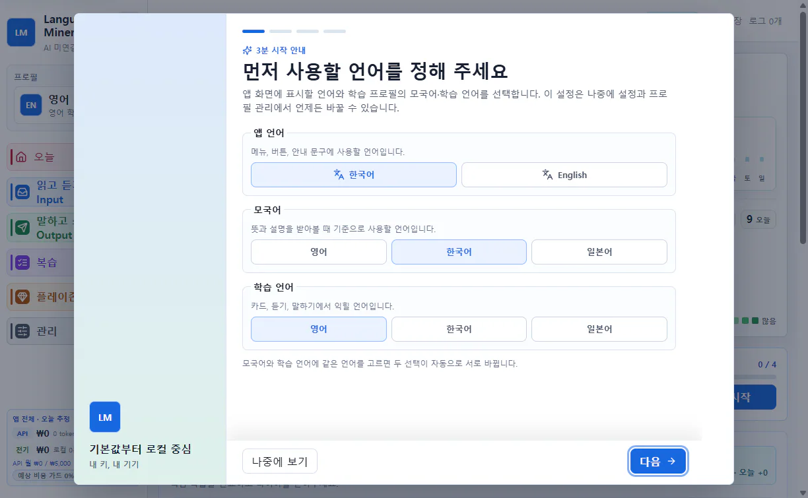

*그림 1. 첫 실행 언어 설정. AI는 연결하지 않고 앱부터 둘러볼 수 있습니다.*

## 3. 첫 학습 루프

첫 실행에서 긴 설정부터 시작하지 마세요. AI 연결은 나중에 해도 됩니다.

### 1단계: 문장 하나 고르기

샘플에서 다음 문장을 선택한다고 가정해 봅니다.

> I’m running a little late.

뜻은 “조금 늦을 것 같아요”입니다. 약속, 출근, 온라인 모임처럼 실제로 자주 쓸 수 있는 상황을 떠올립니다.

먼저 **관리 → 튜토리얼 → 읽기 카드 → 웹 리더**에서 선택 조작을 연습할 수 있습니다. 튜토리얼은 실제 앱을 복제한 샌드박스이므로 진행률만 기록하고 실제 카드 목록은 바꾸지 않습니다.

실제 카드를 만들 때는 **읽고 듣기 · Input → 웹 리더**를 열고, 홈의 **Language Miner 연습 글**을 선택하세요. 이 글은 앱에 내장되어 외부 웹사이트에 접속하지 않습니다. `running a little late`를 드래그하고 `문장카드`를 누르면 원문과 가까운 문맥이 실제 카드 후보로 이어집니다.

> 새 프로필에는 같은 문장의 기본 샘플 카드가 있을 수 있습니다. 저장 흐름을 직접 확인하면 유사한 카드가 둘 보일 수 있으며, 이후 필요 없는 하나를 숨기거나 삭제하면 됩니다.

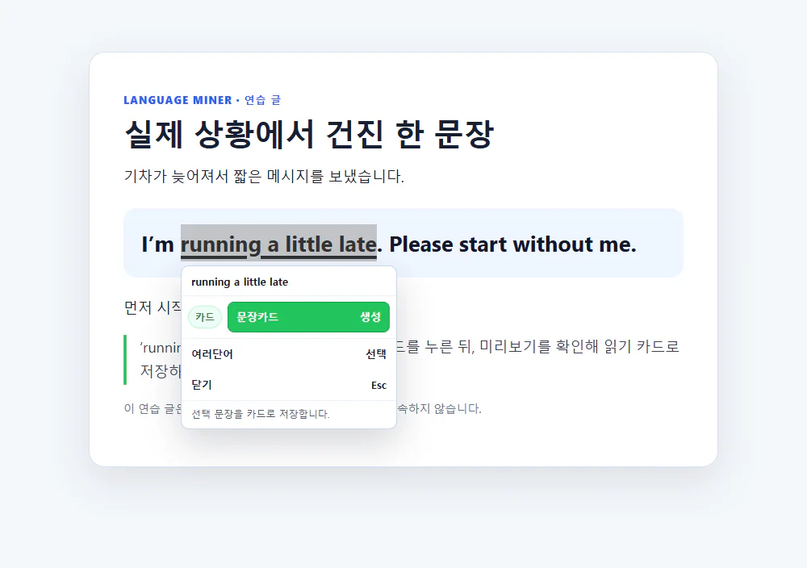

*그림 2. 원문을 읽던 자리에서 표현을 선택하고 문장카드를 만듭니다.*

### 2단계: 읽기 카드 미리보기

이번 웹 리더 흐름에서는 **읽기 카드** 하나를 만듭니다. 영어 문장을 보고 뜻과 상황을 떠올리는 카드입니다. 본문, 뜻, 힌트가 내 의도와 맞는지 확인하고 필요한 부분을 고친 뒤 `카드 담기`를 누릅니다. 듣기 카드와 말하기 카드는 뒤의 각 입력 화면에서 따로 만듭니다.

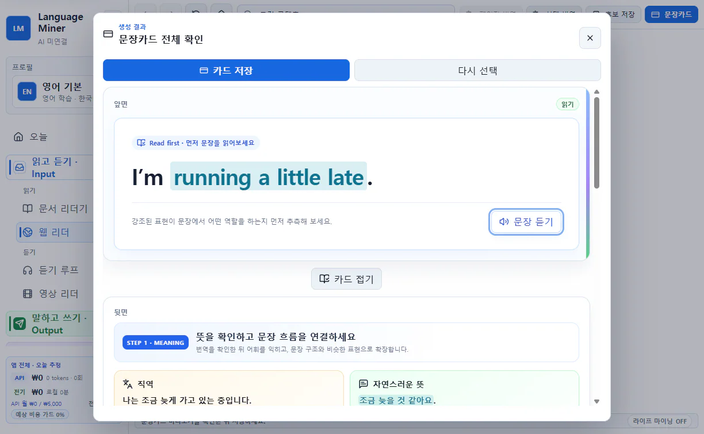

*그림 3. 자동으로 채워진 내용도 직접 고친 뒤 카드에 담을 수 있습니다.*

### 3단계: 첫 복습

복습 화면에서 `복습 시작`을 누르고 답을 떠올린 뒤 `답 보기`로 정답을 확인합니다. 어렵게 기억했다면 `다시` 또는 `어려움`을, 바로 떠올랐다면 `좋음` 또는 `쉬움`을 선택합니다. 평가는 다음 복습 시점을 조절합니다.

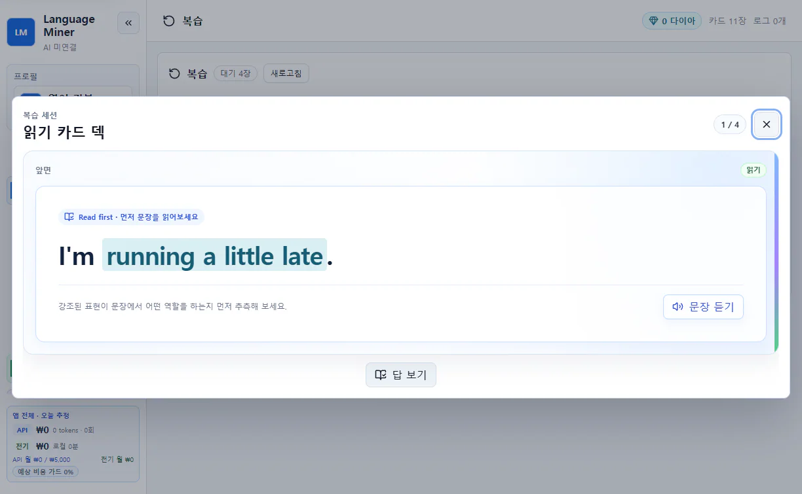

*그림 4. 답 보기를 누르기 전에 뜻과 상황을 먼저 떠올립니다.*
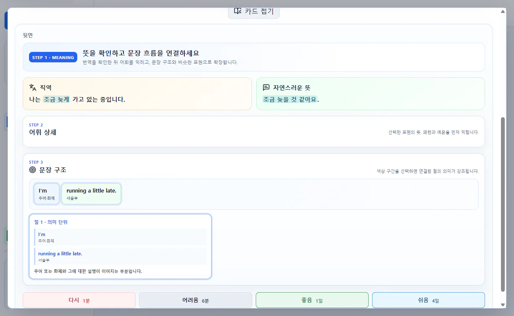

*그림 5. 평가는 점수가 아니라 다음 복습 간격을 정하는 신호입니다.*

### 4단계: 다시 사용하기

영작에서 “친구에게 조금 늦는다고 알려 주세요”라는 상황을 보고 직접 입력합니다. `답 보기`로 내 답안과 추천 답안을 비교하고, 필요하면 `다시 쓰기`로 한 번 더 꺼내 봅니다. 캐릭터챗을 연결했다면 약속 대화에서도 같은 표현을 사용할 수 있습니다. 여기까지가 한 번의 학습 루프입니다.

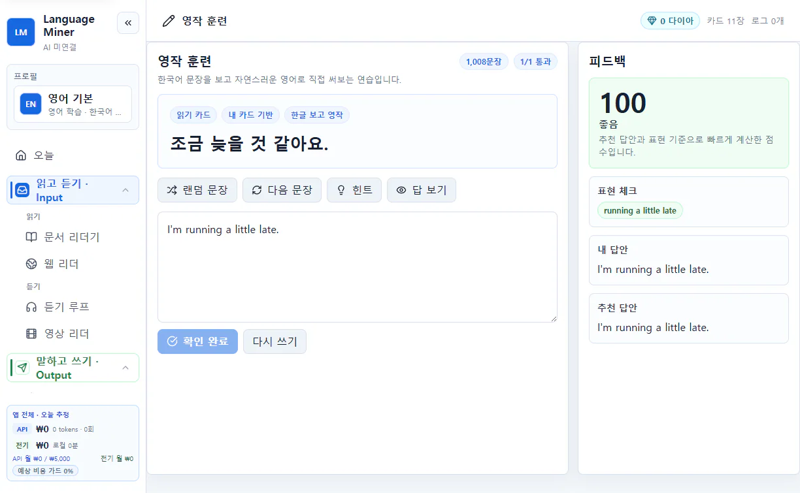

*그림 6. 같은 뜻을 보고 영어 문장을 직접 꺼낸 뒤 답안을 비교합니다.*

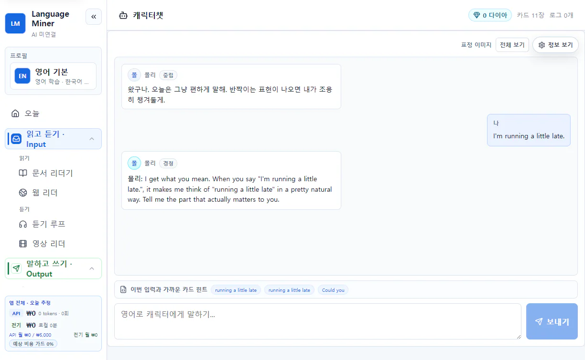

*그림 7. 복습한 문장을 약속 상황의 대화로 옮깁니다.*

## 4. 내 문장으로 카드 만들기

### 문서와 웹

1. 읽고 듣기에서 문서 리더 또는 웹 리더를 엽니다.
2. 필요한 문장을 선택합니다.
3. 카드 만들기를 선택합니다.
4. 문장 전체, 뜻, 앞뒤 맥락을 확인합니다.
5. 카드 종류와 덱을 고르고 `카드 담기` 또는 해당 화면의 저장 동작을 누릅니다.

로그인이 필요한 웹사이트는 해당 사이트의 정책을 따라야 합니다. 웹 리더 쿠키는 로컬 Electron 세션에 남을 수 있으며, 설정에서 지울 수 있습니다.

### 듣기와 영상

1. 로컬 미디어 또는 지원되는 소스를 엽니다.
2. 자막·전사 구간과 반복 범위를 확인합니다.
3. 듣기 카드에 필요한 음성·문장·힌트를 미리 봅니다.
4. 원본 미디어 경로가 백업에 포함되지 않는다는 점을 기억합니다.

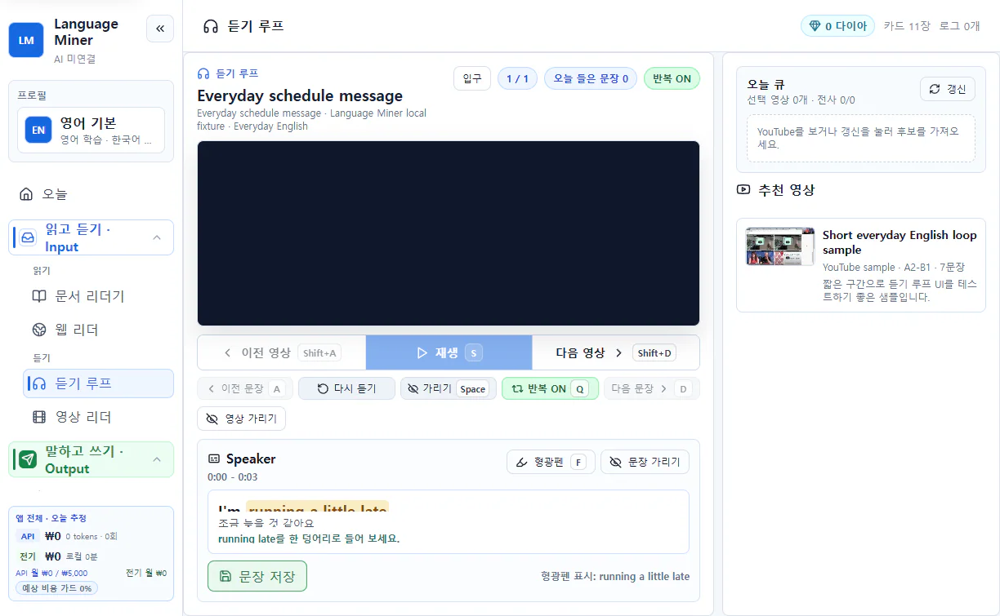

*그림 8. 글로 아는 문장을 실제 소리에서도 알아듣도록 구간을 반복합니다.*

### Life Mining

Life Mining은 내가 실제로 쓰고 싶었던 표현을 후보로 모으는 선택형 기능입니다. 자동 수집은 기본적으로 꺼져 있습니다.

확장을 사용할 때는 허용 사이트, 본인 메시지만 수집할지, 앞뒤 문맥, 최대 길이와 마스킹 규칙을 먼저 설정하세요. 오프라인 대기 항목은 앱에 전달되기 전 브라우저 확장 저장소에 잠시 남을 수 있습니다.

## 5. 복습과 영작

- **읽기 카드:** 영어를 보고 의미를 회상합니다.
- **듣기 카드:** 소리를 듣고 표현을 회상합니다.
- **말하기 카드:** 뜻이나 상황에서 영어를 만들어 냅니다.

정답 문장을 그대로 복사하기보다 먼저 소리 내 말하거나 입력해 보세요. 틀린 부분은 별도의 실패가 아니라 다음 카드와 연습을 정교하게 만드는 정보입니다.

## 6. 캐릭터챗

캐릭터챗은 배운 표현을 상황 속에서 사용해 보는 연습 공간입니다.

1. 캐릭터와 대화 상황을 고릅니다.
2. 로컬 또는 클라우드 AI 연결 상태를 확인합니다.
3. 클라우드 AI를 쓸 때는 실행 전 전송 안내를 읽습니다.
4. 대화 중 배운 표현을 한 번 이상 직접 사용합니다.

클라우드 제공자에는 캐릭터 설정, 최근 대화, 입력한 메시지와 카드 힌트가 전송될 수 있습니다. 민감한 실명, 연락처, 회사 정보, 의료·금융 정보는 입력하지 마세요. 캐릭터 이미지가 원격 URL일 때는 확인 후 불러옵니다.

## 7. PlayZone과 UGC

PlayZone은 HTML 기반 게임팩을 격리된 실행 환경에서 여는 공간입니다.

- 설치 전에 제작자, 버전, 출처, 라이선스, 파일 해시, 요청 권한과 경고를 확인합니다.
- `ready` 또는 `trusted_official` 상태만 실행할 수 있습니다.
- `warning`, `blocked`, `quarantined` 상태는 실행되지 않습니다.
- 네트워크는 기본 거부됩니다.
- 다이아 사용은 팩이 미리 선언한 동작과 금액만 사용자 확인 후 처리합니다.

GitHub Releases를 원본으로 권장합니다. Discord와 Google Drive 링크는 발견 경로일 뿐, 공식 검증이나 저작권 보증을 뜻하지 않습니다. [UGC 정책](ugc-policy.ko.md)

공식 게임은 `어비스 서머너`, `드릴하트 디펜스`, `고양이 오디세이`입니다. 아직 설치하지 않은 게임에서 `설치하고 플레이`를 누르고, 용량·원본·라이선스·SHA-256·요청 권한을 확인한 뒤 `확인하고 다운로드`를 선택합니다. 검사가 끝나 실행 가능한 상태가 되면 `플레이`를 누릅니다.

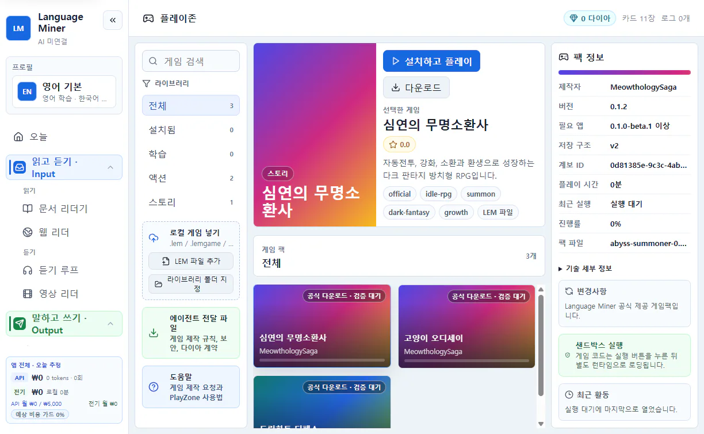

*그림 9. Language Miner 개발자 공식 게임 세 종류.*
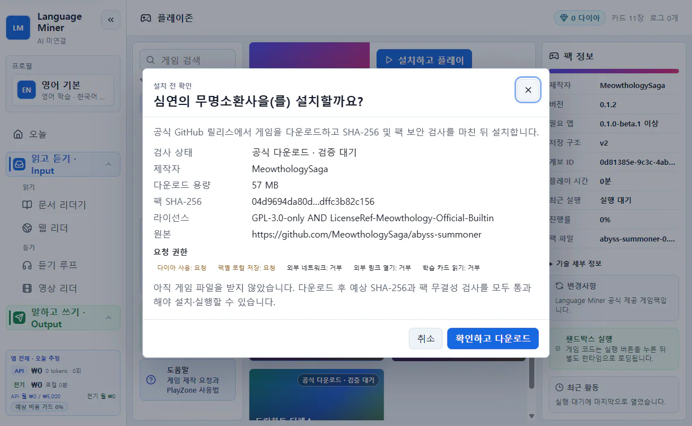

*그림 10. 다운로드 전 파일과 요청 권한을 확인합니다.*
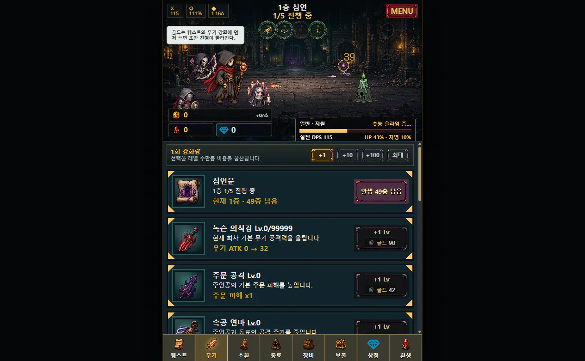

*그림 11. 검사를 마친 게임만 별도 런타임에서 실행합니다.*

## 8. AI 연결

### AI 미연결

새 설치의 기본값입니다. 카드 저장과 복습처럼 AI가 필요 없는 기능부터 사용할 수 있습니다.

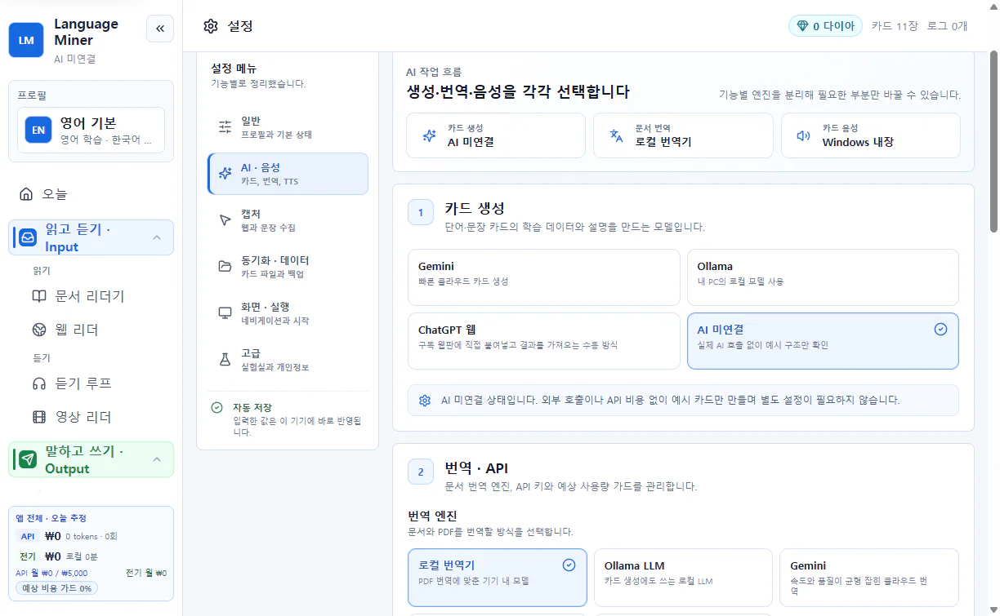

*그림 12. 새 설치는 AI 미연결로 시작합니다.*

### Ollama

Ollama는 별도 설치가 필요한 외부 프로그램입니다. `localhost`, `127.0.0.1`, `::1` 같은 loopback 주소일 때만 로컬 연결로 취급합니다. LAN 주소나 인터넷 주소를 입력하면 요청 내용이 다른 기기로 전송될 수 있습니다.

앱에서 `Ollama 실행 및 연결`을 누르면 실행을 시도하고, 프로그램이 없거나 모델이 준비되지 않았다면 다음 행동을 안내합니다.

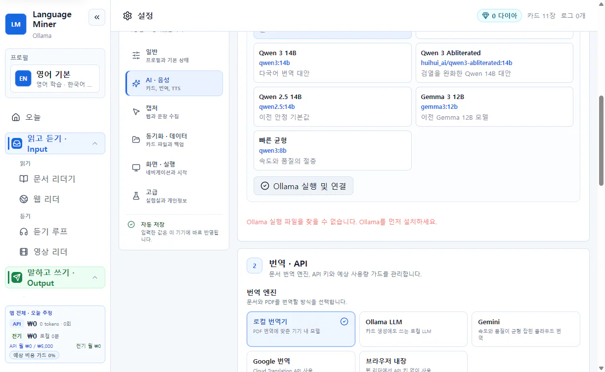

*그림 13. 앱 연결 문제와 Ollama 실행·모델 준비 상태를 구분해 확인합니다.*

### ChatGPT 웹 수동 브리지

설정의 카드 생성에서 `ChatGPT 웹`을 선택하면 별도 API 키 없이 ChatGPT 구독 웹판을 수동으로 사용할 수 있습니다.

1. 카드 생성을 누르고 전송될 문장과 문맥을 확인합니다.
2. 민감정보를 지운 뒤 프롬프트를 복사합니다.
3. 기본 브라우저에서 ChatGPT를 열어 프롬프트를 붙여넣습니다.
4. 답변 전체를 Language Miner 다이얼로그에 붙여넣고 `검증하고 사용`을 누릅니다.

앱은 ChatGPT 계정, 쿠키, 대화 페이지에 접근하지 않습니다. 확장 프로그램이나 백그라운드 자동 카드 생성에는 이 수동 방식을 사용하지 않습니다.

### Gemini·Google

클라우드 기능은 본인의 API 키를 사용하는 BYOK 방식입니다.

연결 및 작업 전 다음을 확인합니다.

- 공급자와 모델;
- 외부로 보낼 문장, 문서 구간 또는 대화 맥락;
- 예상 호출 수와 비용 범위;
- 작업 중지 방법;
- API 키의 저장 상태.

앱의 비용 가드는 로컬 추정치입니다. 실제 과금을 막지 못하므로 Google Cloud에서 API 제한, 키 제한, 할당량과 예산 알림도 별도로 설정하세요. 무료 등급 선택만으로 비용이 0원이라고 가정하지 마세요.

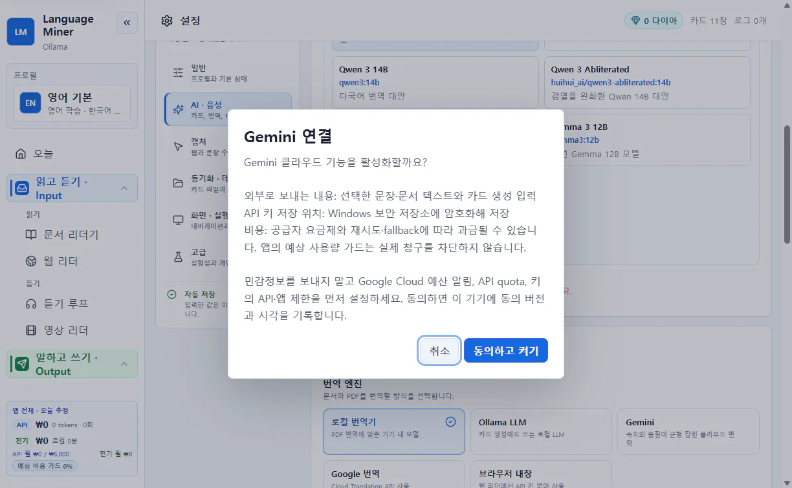

*그림 14. 첫 연결에서 외부 전송·키 저장·비용 경계를 확인합니다. 실제 작업 전에는 별도의 사전 확인이 한 번 더 나타납니다.*

## 9. 백업과 복원

`.lembackup`은 카드, 어휘, 복습, 하이라이트, 프로필, Life Mining, 듣기 전사, 캐릭터 프리셋·대화, 루틴·미션과 PlayZone 저장을 묶는 버전형 백업입니다.

백업에서 제외되는 항목:

- API 키, OAuth 토큰, 로그인 쿠키;
- 웹 리더 세션·탐색 상태와 이 기기의 클라우드 전송 동의 기록;
- 로컬 원본 파일 경로;
- OCR 캡처와 로그;
- TTS·번역 캐시와 로컬 모델;
- 원본 PDF, 오디오, 영상과 생성된 내보내기 파일.

복원 전에 앱은 체크섬, 크기, 버전과 프로필 충돌을 확인합니다. 새 프로필로 복원, 병합, 교체 중 결과를 미리 확인하고 선택하세요. 교체 복원 직전에는 안전 백업을 만듭니다.

백업 파일에는 대화와 학습 기록이 평문으로 들어갈 수 있습니다. 암호화된 개인 저장소에 보관하고 공유하지 마세요.

`백업 파일 만들기`로 저장하고, 복원할 때는 `새 프로필로 복원`, `겹치지 않는 데이터 합치기`, `현재 데이터 교체` 중 결과를 미리 보고 선택합니다.

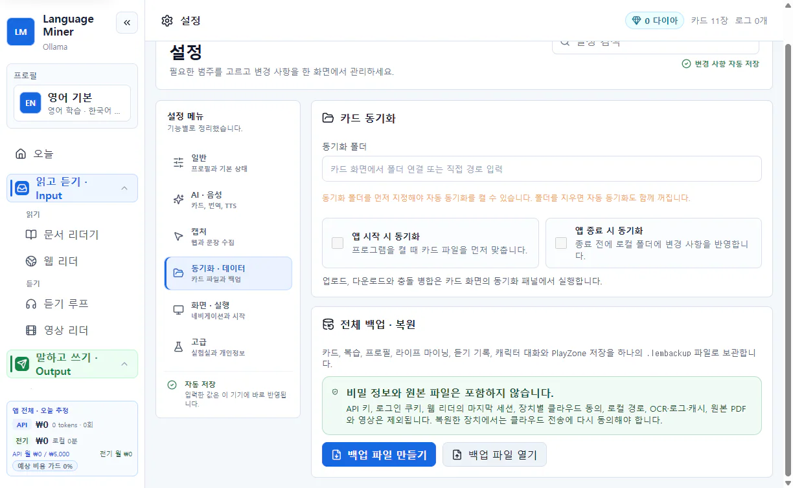

*그림 15. 키와 원본 파일을 제외하고 학습 기록을 lembackup으로 저장합니다.*
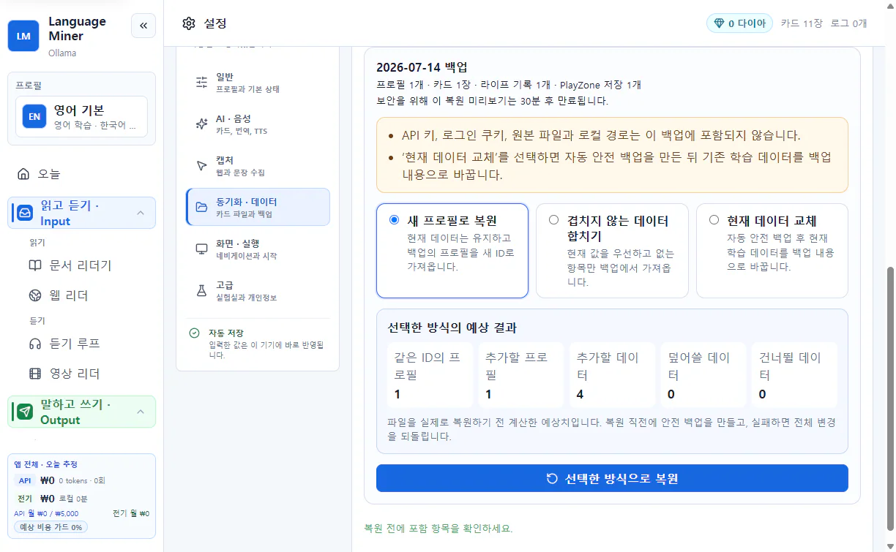

*그림 16. 복원 결과와 충돌을 확인한 뒤 방식을 선택합니다.*

## 10. 데이터 지우기

설정의 개인정보·데이터 관리에서 기능별로 다음 항목을 지울 수 있습니다.

- 웹 리더 로그인 쿠키;
- 확장 오프라인 대기 큐;
- API 키;
- 재생성 가능한 캐시;
- 전체 로컬 학습 데이터.

앱 제거 프로그램만 실행하면 사용자 데이터가 남을 수 있습니다. 다른 사람에게 PC를 넘기기 전에는 앱 안에서 전체 삭제를 마치고, 필요한 백업을 별도 보관한 다음 제거하세요.

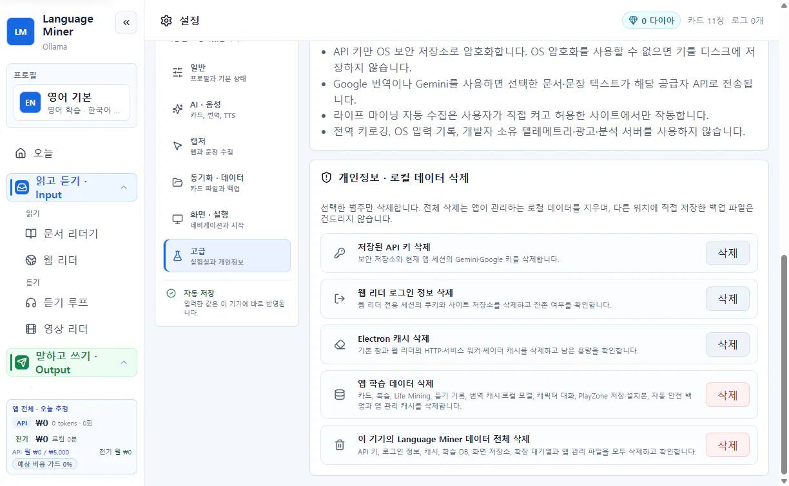

*그림 17. 필요한 범주만 지우거나 이 기기의 Language Miner 데이터를 전체 삭제합니다.*

## 11. 브라우저 확장 베타

첫 공개 베타에서는 Chrome Web Store가 아닌 수동 설치형 선택 기능입니다.

1. 앱과 같은 GitHub Release에서 `Language-Miner-Extension-<version>.zip`과 `SHA256SUMS.txt`를 받습니다.
2. ZIP의 SHA-256 값이 `SHA256SUMS.txt`의 같은 파일명 값과 일치하는지 확인합니다.
3. ZIP을 빈 폴더에 압축 해제합니다. Chrome에 ZIP 파일 자체를 선택하지 마세요.
4. Chrome에서 `chrome://extensions`를 열고 **개발자 모드**를 켠 뒤 **압축 해제된 확장 프로그램을 로드합니다**를 누릅니다.
5. 압축을 푼 폴더 중 `manifest.json`이 바로 보이는 폴더를 선택합니다. 그 상위 폴더를 선택하면 로드되지 않습니다.
6. 앱 설정에서 페어링 상태와 권한을 확인하고, 허용 사이트와 수집 범위를 최소로 설정합니다.

문장 카드 선택 도구는 일반 웹페이지에서 선택한 문장을 카드로 만들기 위해 넓은 사이트 접근 권한을 요청합니다. 텍스트를 드래그하는 것만으로는 전송하지 않으며, 문장 카드 버튼을 누른 뒤에만 선택 표현·출처 문장·페이지 제목·URL·가까운 문맥을 로컬 앱으로 보냅니다. 이 권한이 불편하면 확장을 설치하지 않아도 데스크톱 앱의 나머지 기능을 사용할 수 있습니다.

확장 권한을 취소하거나 토큰을 바꾸면 재페어링이 필요할 수 있습니다. 전달 실패 항목은 대기 큐에서 확인하고 직접 지울 수 있습니다.

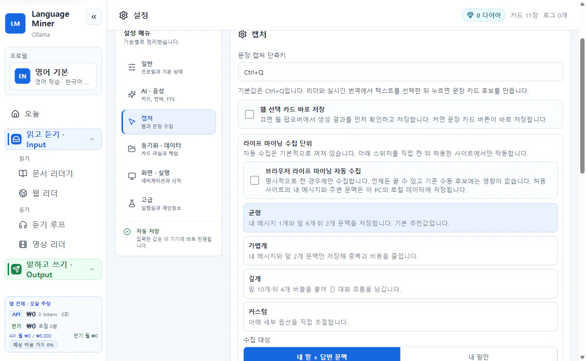

*그림 18. 앱에서 브라우저 수집 범위를 줄입니다. 대기열 전체 삭제는 Chrome 확장 옵션에서 합니다.*

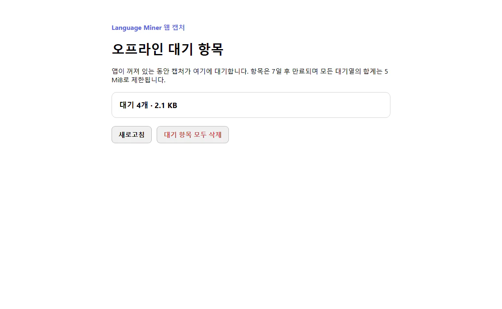

*그림 19. 빈 대기열에서는 삭제 버튼이 비활성화됩니다. 항목이 쌓였을 때 같은 위치에서 모두 삭제합니다.*

## 12. 문제 해결

- **AI 요청 실패:** 공급자 상태, 모델명, 키 제한, 할당량, 원격 URL을 확인합니다.
- **비용 추정치가 실제 청구와 다름:** 앱 수치는 추정치입니다. 공급자 콘솔의 사용량과 청구 내역을 기준으로 판단합니다.
- **미디어가 복원 후 열리지 않음:** 원본 파일과 경로는 백업에 포함되지 않습니다. 파일을 다시 선택하세요.
- **UGC가 실행되지 않음:** 보안 리포트의 상태와 차단 코드를 확인하고 제작자에게 수정된 새 버전을 요청하세요.
- **SmartScreen 경고:** 출처와 SHA-256을 확인하지 못했다면 실행하지 마세요.

일반 버그는 공개 이슈 템플릿으로, 취약점이나 개인정보 노출은 [비공개 보안 신고 절차](../SECURITY.md)로 알려 주세요.
